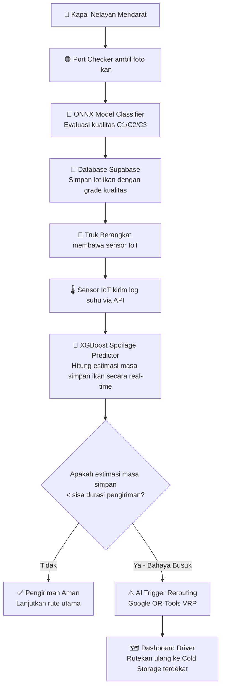

# NusaCatch: Smart Cold-Chain Logistics & Quality Assurance for Indonesian Fisheries

Dokumen spesifikasi ini dibuat untuk merancang inovasi **NusaCatch** dalam kompetisi **AI Innovation Challenge (AIC)**. Spesifikasi ini dirancang agar sepenuhnya mematuhi aturan pembatasan ruang lingkup MVP dan memaksimalkan poin penilaian orisinalitas, dampak sosial, serta kematangan arsitektur AI.

---

## 1. Latar Belakang (Problem & Social Impact)

*   **Paradoks Maritim Indonesia:** Sebagai negara kepulauan terbesar, potensi perikanan tangkap Indonesia sangat besar (lebih dari 6.4 juta ton per tahun). Namun, **angka kehilangan hasil pascapanen (*food/post-harvest loss*) perikanan nasional diperkirakan mencapai 30% (KKP) hingga 35% (FAO) [1], [2]**, dengan rentang susut hasil fisik di lapangan berkisar antara 20% hingga 29% [3].
*   **Rising Problem: Penolakan Ekspor & Bahaya Histamin:** 
    Ikan golongan *scombroid* (seperti tuna dan kembung) sangat rentan terhadap pembentukan **histamin** jika terpapar suhu di atas 4°C akibat terputusnya rantai dingin (*cold-chain*) [7]. Histamin adalah senyawa kimia pemicu keracunan makanan (*scombroid fish poisoning*) yang tidak bisa dihilangkan meski dimasak dengan suhu tinggi [8]. Hal ini menjadi penyebab utama **penolakan produk ekspor perikanan Indonesia** oleh negara tujuan seperti Amerika Serikat (FDA) dan Uni Eropa (RASFF) [7], [9], yang mengakibatkan kerugian ekonomi hingga miliaran rupiah bagi pelaku usaha dan eksportir lokal.
*   **Akar Masalah Operasional:**
    1.  **Kerusakan di Logistik:** Sebagian besar ikan mengalami penurunan mutu di jalan karena kegagalan pemantauan suhu rantai dingin yang dinamis selama perjalanan logistik [3].
    2.  **Ketidakadilan Harga di Hulu:** Nelayan kecil tidak memiliki standar objektif untuk menentukan kesegaran ikan, membuat penentuan harga di pelabuhan hulu rentan manipulasi sepihak [3].
*   **Dampak Sosial & Ekonomi:** NusaCatch hadir untuk memberdayakan nelayan lokal melalui transparansi grading AI di pelabuhan hulu berdasarkan standar nasional [4], menekan persentase kehilangan pangan perikanan nasional, serta mencegah kerugian ekspor akibat kontaminasi histamin melalui deteksi dini & optimasi rute logistik secara dinamis.

---

## 2. Problem-Solution Fit Matrix

Tabel di bawah ini memetakan bagaimana fitur teknologi AI NusaCatch memecahkan akar permasalahan di sepanjang rantai pasok dingin perikanan Indonesia:

| Tahap Rantai Pasok | Masalah Riil (Rising Problem) | Akar Penyebab (Root Cause) | Solusi Pintar NusaCatch (AI Feature) | Dampak Bisnis & Sosial (Fit) |
| :--- | :--- | :--- | :--- | :--- |
| **Hulu (Dermaga & Pelabuhan)** | Penentuan kesegaran ikan subjektif & fluktuasi harga menekan nelayan kecil [3]. | Tidak adanya alat ukur mutu fisik yang murah, cepat, dan terstandar secara objektif di daerah terpencil. | **AI Freshness Grading (ONNX MobileNetV3)**: Grading mutu otomatis berstandar SNI 2729:2013 [4] melalui pemindaian foto mata/insang ikan dari HP. | Nelayan mendapatkan nilai jual adil yang transparan berbasis kualitas riil; mencegah monopoli pengepul. |
| **Transit (Logistik & Pengiriman)** | Susut mutu hasil laut di jalan tinggi; 30-35% ikan rusak di logistik [1], [2]. | Kerusakan pendingin kontainer (*cold-chain failure*) di jalan yang terlambat dideteksi [3]. | **AI Spoilage Predictor (XGBoost Regressor)**: Prediksi sisa masa kelayakan konsumsi secara real-time berdasarkan log sensor IoT suhu & gas DaFiF [5]. | Operator logistik mendapat peringatan dini sebelum ikan membusuk total di perjalanan. |
| **Hilir (Distribusi & Ekspor B2B)** | Penolakan ekspor ikan tuna & kembung oleh FDA/RASFF akibat racun histamin [7], [9]. | Ikan terpapar suhu > 4°C selama transit, memicu aktivitas bakteri pembentuk histamin [7]. | **AI Dynamic VRP Rerouting (Google OR-Tools)**: Pengalihan rute truk otomatis secara dinamis ke *cold storage* terdekat saat AI mendeteksi risiko lonjakan suhu berbahaya. | Mencegah kerugian finansial ratusan juta rupiah dari re-ekspor atau pemusnahan kargo di pelabuhan internasional. |

---

## 3. Tujuan & Manfaat Pengembangan

*   **Tujuan:** Membangun platform manajemen rantai dingin perikanan pintar terintegrasi yang mendeteksi kesegaran hasil laut secara objektif berbasis visi komputer dan merutekan ulang pengiriman secara dinamis berbasis estimasi tingkat pembusukan.
*   **Manfaat bagi Aktor:**
    *   **Nelayan / Port Checker:** Mendapatkan *Freshness Grade* objektif yang transparan untuk negosiasi harga yang adil dengan pembeli.
    *   **Operator Logistik:** Mendapatkan peringatan dini apabila suhu boks pendingin rusak di jalan beserta rute alternatif penyelamatan muatan.
    *   **B2B Buyers (Restoran/Supermarket):** Jaminan pasokan ikan berkualitas tinggi dengan transparansi rekam jejak suhu perjalanan.

---

## 4. Metodologi Data & AI Core (Concrete Dataset)

NusaCatch menggunakan satu dataset riset publik yang sangat komprehensif untuk melatih seluruh model AI-nya, yaitu **DaFiF (Dataset for Fish Freshness)** [5]. Ini memastikan keselarasan penuh antara data citra, data sensor, dan standar penilaian nasional.

### A. AI Freshness Grading (Computer Vision)
*   **Dataset:** **DaFiF** bagian citra (Mackerel: 859 gambar, Tilapia: 840 gambar, Tuna: 837 gambar) [5].
    *   **Pemetaan Label (Preprocessing):** Karena dataset DaFiF mencatat tingkat kesegaran berdasarkan **Hari Penyimpanan (*Days of Storage* dalam Es)** [6], kami melakukan pelabelan kelas (*data thresholding*) saat preprocessing sebagai berikut:
        *   **Hari 0–2:** Kelas **C1 (Fresh)** - Ikan segar prima.
        *   **Hari 3–4:** Kelas **C2 (Moderate)** - Ikan kesegaran sedang.
        *   **Hari 5+:** Kelas **C3 (Spoiled)** - Ikan busuk / tidak layak konsumsi.
    *   **Standardisasi Evaluasi:** Penentuan batas hari ini diselaraskan dengan hasil analisis organoleptik mengacu pada **Standar Nasional Indonesia (SNI) 2729:2013** [4].
*   **Arsitektur Model:** **MobileNetV3 / ResNet-18 Image Classifier**
    *   **Alasan:** Ukuran model sangat ringkas untuk dikonversi menjadi format **ONNX Runtime** dan dijalankan secara lokal di CPU backend (*Edge AI*).
*   **Preprocessing Citra:** Resize gambar menjadi $224 \times 224$ piksel, normalisasi kanal warna, dan augmentasi gambar (flip horizontal/vertikal, penyesuaian kontras) untuk mensimulasikan kondisi kamera di dermaga/pasar.

### B. AI Spoilage Predictor & Dynamic Routing (Predictive ML & VRP)
*   **Dataset:** **DaFiF** bagian sensor data (9.401 data sensor untuk tiap spesies) [5].
    *   **Sensor Terlibat:** Sensor gas MQ-135 (mendeteksi gas pembusukan) dan TGS-2602 (mendeteksi senyawa bau/VOC) yang memetakan tingkat kesegaran ikan selama masa penyimpanan es (*ice storage*) [6].
*   **Arsitektur Model Prediksi:** **XGBoost / LightGBM Regressor**
    *   **Inputs:** `[durasi_transit, suhu_rata_rata, lonjakan_suhu_terakhir, estimasi_sensor_gas]`.
    *   **Output:** `[Remaining Freshness Index (0 - 100%)]`.
*   **Algoritma Rerouting:** **Google OR-Tools VRP (Vehicle Routing Problem)**
    *   Jika model regressor memprediksi *Remaining Freshness Index* akan turun di bawah batas aman sebelum sampai di pelabuhan/gudang utama, sistem akan otomatis merutekan ulang pengiriman ke *cold storage* atau pasar sekunder terdekat.

## 5. User Roles & RBAC (Role-Based Access Control)

Sistem dirancang dengan pembatasan hak akses berbasis peran (RBAC) untuk menjaga integritas data operasional dan keamanan rantai pasok:

1.  **Port Checker (Operator Pelabuhan/Hulu):**
    *   **Wewenang:** Mencatat pendaratan hasil tangkapan, mengambil foto sampel fisik, dan menginisiasi Lot Baru.
    *   **Akses Halaman:** *Port Intake Page* (Unggah Foto $\rightarrow$ Jalankan ONNX Freshness Grading $\rightarrow$ Kirim ke Logistik).
2.  **Fleet Manager (Operator Logistik/Transit):**
    *   **Wewenang:** Menentukan tujuan pengiriman, memantau grafik sensor IoT suhu boks pendingin, dan menyetujui rekomendasi pengalihan rute darurat (*AI Rerouting Approval*).
    *   **Akses Halaman:** *Logistics Control Page* (Peta Live Routing $\rightarrow$ Alert Spike Suhu $\rightarrow$ Tombol Eksekusi Reroute).
3.  **Buyer & Consumer Hilir (B2B, B2C, & B2Gov):**
    *   **Klasifikasi Tipe User:**
        *   **B2B Buyer (Fokus Utama Aplikasi):** Procurement Manager Supermarket, Pabrik Pengolahan, dan Eksportir. Mereka *sangat membutuhkan* data detail ini untuk proses *Quality Assurance* (QA) sebelum menerima kargo senilai puluhan juta rupiah.
        *   **B2C Consumer (Pasif-Informatif):** Pembeli eceran di supermarket. Cukup memindai QR Code di kemasan ikan menggunakan HP untuk melihat *Landing Page* ringkas: *"Ikan Tuna Grade A Segar, ditangkap di Maluku 2 hari lalu, terjaga di suhu -2°C"* (membangun *brand trust*).
        *   **B2Gov Regulator (Kepatuhan):** Petugas karantina ikan atau BPOM untuk memverifikasi kepatuhan rantai dingin logistik bahan pangan hewani secara digital.
    *   **Penggunaan AI untuk B2B Buyer:**
        1.  **AI Quality Verification (Verifikasi Mutu Kedatangan):** Mengambil foto sampel ikan yang tiba untuk melakukan verifikasi silang (re-run model visi ONNX) guna memastikan kualitas tidak turun dari pelabuhan asal.
        2.  **AI Sensory Fusion (Estimasi Sisa Masa Simpan):** AI XGBoost memproses data sensor suhu & gas selama transit untuk menerbitkan *Digital Quality Certificate* berisi sisa hari layak konsumsi produk.
        3.  **RAG Procurement Assistant:** Chatbot berbasis LLM & RAG untuk menanyakan riwayat log suhu lot secara alami (misal: *"Apakah lot tuna TNA-20260702 mengalami lonjakan suhu di atas 4°C?"*).
    *   **Akses Halaman:** *Receiving & Audit Page* (Scan QR Lot $\rightarrow$ Tampilan Grafik Kepatuhan Dingin Transit $\rightarrow$ RAG Chatbot Asisten Pengadaan).

---

## 6. Alur Integrasi Sistem (System Architecture)

---

## 7. Batasan Ruang Lingkup MVP (Kepatuhan Lomba)

Untuk menghindari penalti penilaian akibat aplikasi yang terlalu luas (*overbuilt*), MVP NusaCatch akan difokuskan hanya pada interaksi inti:

1.  **Frontend (Next.js & Mantine UI):**
    *   Halaman **Port Intake:** Antarmuka sederhana untuk mengunggah foto ikan dan melihat hasil grading AI (C1/C2/C3) beserta penentuan harga dasar secara otomatis.
    *   Halaman **Logistics Control:** Peta interaktif (menggunakan Leaflet/Mapbox) yang menampilkan rute truk berjalan, grafik sensor suhu real-time, dan indikator status kesegaran pengiriman. Dilengkapi dengan simulasi tombol "Simulate Temp Spike" untuk memicu demo sistem rerouting AI secara langsung.
2.  **Backend (FastAPI & Supabase DaaS):**
    *   API inferensi ONNX untuk pengolahan gambar.
    *   API pemrosesan log sensor dan kalkulasi rute optimal menggunakan OR-Tools.

---

## 8. Metrik Keberhasilan AI (Untuk Penjurian)

Untuk memperkuat bagian Metodologi Proposal:
1.  **Freshness Image Classifier:** Target *F1-score* minimal **85%** pada klasifikasi kategori C1 (Fresh), C2 (Moderate), dan C3 (Spoiled).
2.  **Spoilage Index Regressor:** Target *R-Squared* minimal **0.88** pada dataset DaFiF Mendeley Data untuk prediksi sisa masa simpan ikan.
3.  **VRP Optimization:** Pengurangan potensi kerugian finansial logistik hingga **25%** dengan rute pengalihan darurat.

---

## 9. Referensi & Sitasi

1.  **Kementerian Kelautan dan Perikanan (KKP):** [Portal Satu Data KKP](https://portaldata.kkp.go.id/).
2.  **Food and Agriculture Organization (FAO):** [Food Loss and Waste in Fish Value Chains Report](https://www.fao.org/in-action/globefish/fishery-information/resource-detail/zh/c/1154101/).
3.  **Jejaring Pasca Panen Perikanan Indonesia (JP2GI):** [Kajian Intervensi Kebijakan Susut Pascapanen Perikanan](https://www.jp2gi.org/).
4.  **Badan Standardisasi Nasional (BSN):** [SNI 2729:2013 - Ikan Segar](https://pesta.bsn.go.id/).
5.  **Prasetyo et al. (2024):** [DaFiF: A Complete Dataset for Fish's Freshness Problems (Data in Brief)](https://doi.org/10.1016/j.dib.2024.111016).
6.  **Prasetyo et al. (2024):** [Standardizing the fish freshness class during ice storage using clustering approach (Ecological Informatics)](https://doi.org/10.1016/j.ecoinf.2024.102533).
7.  **KKP BPPMHKP:** [Edukasi Penanganan Histamin untuk Jaga Mutu Hasil Perikanan](https://kkp.go.id/).
8.  **Badan Pengawas Obat dan Makanan (BPOM):** [Pedoman Keamanan Pangan Produk Perikanan](https://www.pom.go.id/).
9.  **European Commission (RASFF):** [Rapid Alert System for Food and Feed Portal](https://ec.europa.eu/food/safety/rasff_en).
