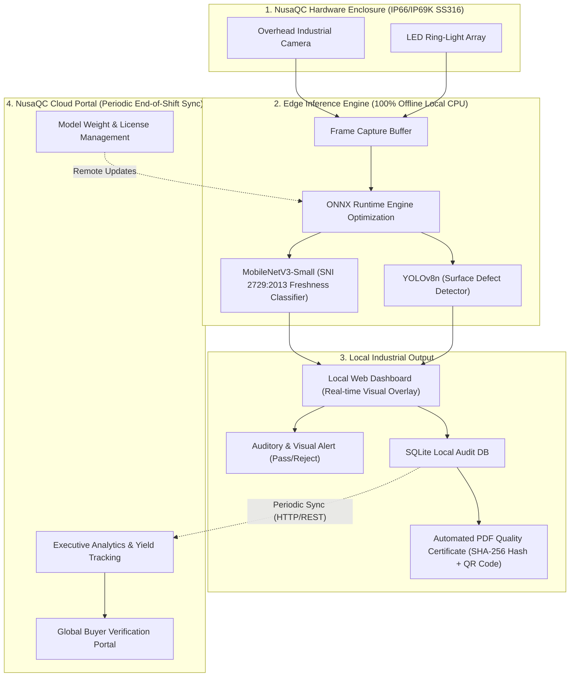
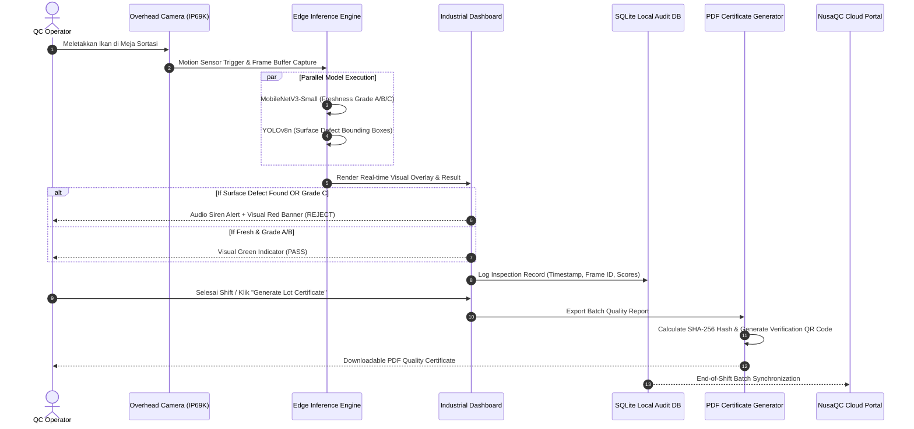
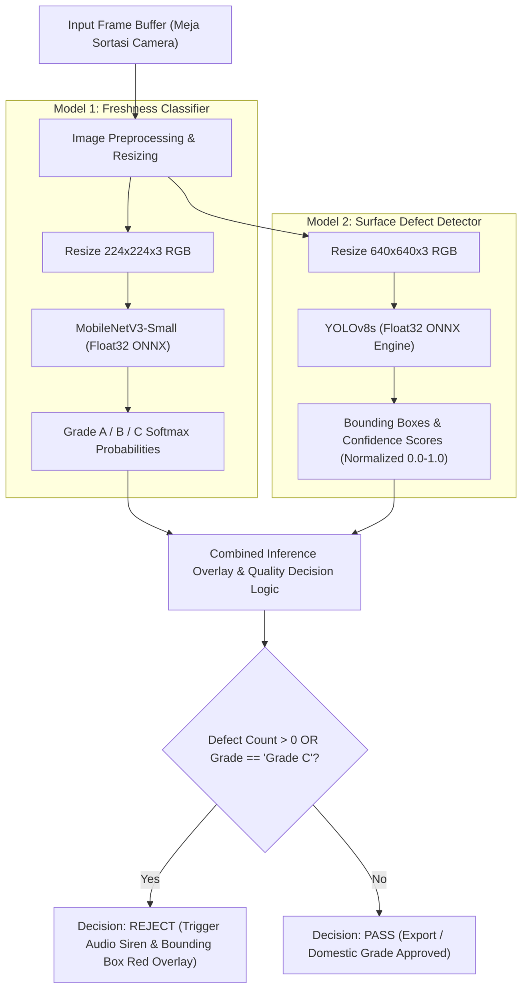
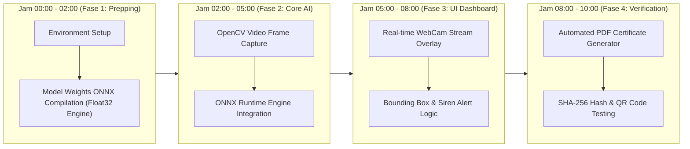

# PROPOSAL INOVASI COMPFEST 18 (AIC)
## NUSAQC: AI-Powered Visual Quality Control & Digital Traceability System untuk Unit Pengolahan Ikan (UPI) Indonesia

---

### RINGKASAN EKSEKUTIF

Penolakan ekspor komoditas perikanan Indonesia di pasar global, seperti oleh US FDA (*FDA Import Refusal*), sebagian besar disebabkan oleh cacat fisik visual seperti pembusukan (*decomposition*), kontaminasi (*filthy/foreign matter*), serta parasit. Permasalahan ini dipicu oleh proses *Quality Control* (QC) di Unit Pengolahan Ikan (UPI) yang masih bergantung pada inspeksi manual. Metode manual ini memiliki keterbatasan berupa subjektivitas operator, kelelahan visual (*human fatigue*), serta kecepatan inspeksi yang terbatas di meja sortasi.

NusaQC hadir sebagai sistem *Smart Manufacturing* berbasis *Edge Computer Vision* dan *Digital Traceability* untuk lini pengolahan perikanan pasca-panen. Sistem ini memanfaatkan dua model AI teroptimasi: MobileNetV3-Small (Float32 ONNX, 0.28 MB) untuk klasifikasi tingkat kesegaran (*Freshness Grading*) berbasis standar baku SNI 2729:2013, serta YOLOv8s (Float32 ONNX) untuk deteksi cacat permukaan (*Surface Defect Detection*). Perangkat beroperasi secara *offline* di meja sortasi menggunakan *enclosure* tahan air berstandar IP66/IP69K (Stainless Steel 316), dan melakukan sinkronisasi log audit terenkripsi ke *Cloud Portal* untuk kebutuhan verifikasi pembeli internasional.

NusaQC mentransformasi proses inspeksi organoleptik menjadi terukur, objektif, dan terverifikasi secara digital melalui sertifikat mutu PDF otomatis yang dilengkapi QR Code dan verifikasi *hash*, sehingga meningkatkan efisiensi dan jaminan mutu industri pengolahan perikanan nasional.

---

## BAB I: PENDAHULUAN & URGENSI MASALAH

### 1.1 Latar Belakang Jaminan Mutu Ekspor Perikanan Indonesia
Sektor kelautan dan perikanan merupakan komoditas ekspor penting bagi Indonesia. Namun, potensi nilai tambah ekspor hasil laut sering terhambat oleh tingkat penolakan produk di pelabuhan tujuan ekspor, seperti oleh US Food and Drug Administration (FDA) dan Rapid Alert System for Food and Feed (RASFF) Uni Eropa.

Data *FDA Import Refusal Logs* menunjukkan bahwa penolakan ekspor hasil laut Indonesia didominasi oleh masalah fisik-organoleptik visual:
1. **Decomposition (Pembusukan Visual):** Penurunan kesegaran daging, perubahan warna insang, kemerahan/kekeruhan mata, dan tekstur lembek akibat gangguan rantai dingin (*cold-chain breakdown*) atau kegagalan deteksi di meja sortasi.
2. **Filthy & Foreign Matter:** Kontaminasi kotoran, benda asing, atau material non-ikan.
3. **Parasites & Visual Diseases:** Keberadaan parasit eksternal, bintik luka, atau infeksi kulit yang tidak terdeteksi saat pengamatan manual.

Penolakan produk di pelabuhan tujuan menyebabkan penahanan barang, pemusnahan kontainer, klaim penalti, hingga risiko pencabutan izin ekspor UPI oleh otoritas setempat.

### 1.2 Keterbatasan QC Manual di Meja Sortasi UPI
Inspeksi mutu pada mayoritas UPI Indonesia masih dilakukan secara manual oleh operator dengan uji organoleptik konvensional. Evaluasi manual ini memiliki beberapa keterbatasan operasional:
* **Subjektivitas Operator:** Penilaian kesegaran dan cacat fisik sangat bergantung pada pengalaman individu, persepsi warna visual, dan tingkat pencahayaan meja sortasi yang tidak seragam.
* **Kelelahan Visual (*Human Visual Fatigue*):** Pemeriksaan ribuan ekor ikan per shift kerja memicu penurunan akurasi inspeksi setelah 2 hingga 3 jam kerja secara terus-menerus, sehingga meningkatkan risiko lolosnya produk cacat (*False Negative*).
* **Kapasitas Periksa Terbatas (*Low Throughput*):** Inspeksi manual membutuhkan waktu 5 hingga 15 detik per ekor, sehingga menjadi titik hambatan (*bottleneck*) dalam proses produksi.
* **Tidak Adanya Log Audit Digital (*Zero Traceability*):** Data hasil QC dicatat manual pada buku log kertas yang rentan kesalahan dan sulit ditelusuri (*untraceable*) secara digital oleh pembeli luar negeri saat kontainer tiba di pelabuhan tujuan.

### 1.3 Korelasi dengan Subtema Smart Manufacturing (AIC COMPFEST 18)
Implementasi Artificial Intelligence (AI) pada lini produksi perikanan mendukung pilar *Smart Manufacturing* dengan memodernisasi pabrik pengolahan perikanan melalui sistem otomatisasi terintegrasi. NusaQC membawa inspeksi visual berkecepatan tinggi pada tingkat *Edge*, mengubah data visual menjadi metrik kualitas yang terukur, serta menyediakan integrasi data rantai pasok dari meja sortasi hingga pasar global.

---

## BAB II: SOLUSI PRODUK & MODEL BISNIS HYBRID

### 2.1 Deskripsi Produk NusaQC & Arsitektur Sistem
NusaQC (*Nusantara Quality Control*) adalah sistem inspeksi visual berbasis pemrosesan AI lokal (*Edge*) yang dirancang untuk meja sortasi dan lini konveyor pengolahan ikan pasca-panen.



### 2.2 User Flow Operasional Meja Sortasi QC
Alur kerja pengguna di meja sortasi UPI dirancang otomatis untuk meminimalkan interaksi manual operator:



### 2.3 Spesifikasi Hardware Enclosure Standar Industri Basah
Pabrik pengolahan ikan (UPI) merupakan lingkungan kerja basah (*wet processing environment*) dengan tingkat kelembapan tinggi, paparan air garam, serta prosedur pembersihan harian menggunakan semprotan air bertekanan tinggi (*high-pressure washdown*).
* **Material Enclosure:** Stainless Steel AISI 316L (tahan korosi air garam dan bahan kimia sanitasi).
* **Rating Proteksi:** IP66 / IP69K (kedap debu total dan tahan semprotan air bersuhu tinggi bertekanan hingga 100 bar).
* **Sealing:** Gasket *Food-grade Silicone* bertaraf FDA compliant.
* **Window Lens:** *Optical Tempered Glass* dengan lapisan *anti-fogging* dan tahan gores (*scratch-resistant*).
* **Operasi Otomatis:** Antarmuka sistem tidak memerlukan interaksi fisik langsung dari operator yang bertangan basah, karena pemrosesan dipicu secara otomatis oleh deteksi pergerakan objek (*motion/presence detection*).

### 2.4 Lingkup Eksekusi MVP Hackathon (Scope Final 10-Jam)
Untuk menjamin eksekusi yang realistis dan terukur selama kompetisi:
1. **Fitur yang Diabaikan untuk MVP:** Chatbot RAG, integrasi sensor IoT suhu/pH kompleks, dan *robotic sorting arm*.
2. **Fokus Utama MVP (Teruji 100%):**
   * **Live WebCam Stream Inference Overlay:** Pemrosesan video interaktif secara *real-time* yang menampilkan *Bounding Box* deteksi cacat dan label kesegaran SNI pada layar *dashboard*.
   * **Automated PDF Export Quality Certificate dengan Cryptographic QR Code:** Pembuatan sertifikat mutu digital otomatis per *batch/lot* produksi yang dilengkapi kode QR unik dan fungsi verifikasi keabsahan data (*anti-tamper*).

### 2.5 Model Bisnis Hybrid Edge-Cloud (B2B Monetization)
NusaQC menerapkan skema pendapatan B2B berbasis kombinasi *Hardware Lease/Purchase* dan *Software-as-a-Service* (SaaS):

| Komponen Bisnis | Deskripsi & Skema Lisensi | Target Segmen |
| :--- | :--- | :--- |
| **Edge Hardware Unit** | Pembelian tunai atau sewa per perangkat enclosure IP69K + Edge Node CPU. | UPI Skala Menengah & Besar (Eksportir). |
| **SaaS Edge License** | Lisensi pemakaian perangkat lunak per meja sortasi per bulan (termasuk *offline inference engine*). | UPI Pengolah Ikan Segar & Beku. |
| **Cloud Audit Portal Subscription** | Biaya berlangganan portal *cloud* untuk analisis manajemen, pembuatan sertifikat digital terverifikasi, dan akses portal audit untuk pembeli luar negeri. | Pembeli Ekspor (AS, UE, Jepang) & UPI Eksportir. |

---

## BAB III: METODOLOGI AI, HARMONISASI LABEL & ARSITEKTUR TEKNIS

### 3.1 Harmonisasi Label Ground Truth SNI 2729:2013
Pelabelan model kesegaran NusaQC disesuaikan dengan standar nasional SNI 2729:2013 (Ikan Segar - Spesifikasi dan Metode Uji). Uji organoleptik pada standar ini memiliki nilai rentang 1 hingga 9.

Harmonisasi ini mengacu pada data ilmiah dari Table 3 Jurnal DaFiF (Prasetyo et al., Data in Brief 57, 2024) serta dataset pendukung terkait:

| Target Label NusaQC | Ground Truth Skor SNI 2729:2013 | Indikator Visual Organoleptik (SNI 2729:2013) | Sumber Data Pelatihan |
| :--- | :--- | :--- | :--- |
| **Grade A** *(Export Grade)* | **Skor Organoleptik 8.0 - 9.0** | Mata cembung bening, insang merah terang tanpa lendir pekat, daging elastis padat, kulit mengkilap segar. | DaFiF & FFE (Penyimpanan Hari 1–2), Mendeley SalmonScan (*Fresh Salmon* - 456 gambar). |
| **Grade B** *(Domestic Grade)* | **Skor Organoleptik 7.0 - 7.9** | Mata rata/agak redup, warna insang merah agak pucat, lendir transparan tipis, batas ambang minimum mutu industri. | DaFiF & FFE (Penyimpanan Hari 3–4). |
| **Grade C** *(Reject Grade)* | **Skor Organoleptik < 7.0** | Mata cekung keruh/tenggelam, insang cokelat/kelabu berlendir pekat, tekstur lunak/berbekas, bau busuk. | DaFiF & FFE (Penyimpanan Hari 5–11), Mendeley SalmonScan (*Infected Salmon* - 752 gambar). |

### 3.2 Konsolidasi Matriks Dataset Terintegrasi

| Kode | Nama Dataset | Sumber & Identifier | Jumlah Sampel | Peran & Rasionale dalam Pipeline AI |
| :--- | :--- | :--- | :--- | :--- |
| **D1** | **DaFiF Image Dataset** | Mendeley Data (Prasetyo et al., 2024) | ~2.536 gambar | **Fine-tuning Utama Model 1 (Freshness Classifier):** Berisi citra serial pembusukan harian yang terhubung langsung ke Skor SNI 2729:2013. |
| **D2** | **Freshness of Fish Eyes (FFE)** | Prasetyo et al., 2022 | 4.390 gambar | **Dataset Sekunder Model 1:** Pelatihan spesifik klasifikasi organ mata (*eye clarity & concavity*). |
| **D3** | **Mendeley SalmonScan** | Mendeley Data (DOI: 10.17632/x3fz2nfm4w.1) | 1.208 gambar *(456 Fresh, 752 Infected)* | **Cross-Domain Validation Model 1:** Menguji ketangguhan generalisasi model kesegaran & penandaan infeksi visual (diolah dari 24 raw fresh & 91 raw infected). |
| **D4** | **BD Fish Disease Dataset** | Roboflow Universe (`Saon110/bd-fish-disease-dataset`) | 2.082 gambar | **Fine-tuning Utama Model 2 (Surface Defect Detection - YOLOv8n):** Menyediakan anotasi *Bounding Box* presisi untuk 7 kelas luka/penyakit fisik permukaan tubuh. |
| **D5** | **Field Validation Test Set** | Pengumpulan Mandiri / Sample Test | ~50-100 gambar | Evaluasi pencahayaan dan variasi lingkungan meja QC nyata. |

### 3.2.1 Strategi Multi-Commodity & Pemetaan Scope Taksonomi Spesies
Untuk menjamin keberterimaan di industri ekspor dengan tetap menjaga akurasi model, NusaQC membatasi cakupan awal pada 8 spesies utama yang terbagi ke dalam 3 kelompok famili ekspor (Cichlidae, Scombridae, Sciaenidae) serta 1 *benchmark cross-domain* (Salmonidae):

1. **Cichlidae Group (*Oreochromis niloticus*, *O. mossambicus*, *Tilapia spp.*):** Komoditas ekspor budidaya utama. Memiliki karakteristik degradasi kornea dan cekungan mata yang seragam dalam satu genus, sehingga sesuai sebagai basis *Transfer Learning*.
2. **Scombridae Group (*Rastrelliger faughni*, *Mackerel*, *Tuna*):** Komoditas ekspor tangkap laut utama Indonesia. Fokus pada deteksi penurunan kesegaran melalui organ mata ikan pelagis.
3. **Sciaenidae & Regional Group (*Johnius trachycephalus*, *Nibea albiflora*, *Chanos chanos*):** Ikan demersal dan bandeng untuk menguji generalisasi model pada pasar domestik dan regional.
4. **Salmonidae Benchmark (*SalmonScan* - 1.208 Gambar):** Pengujian *Cross-Domain Validation* untuk pemodelan infeksi penyakit kulit atau permukaan (*Surface Defect Detector*).

Pendekatan *Taxonomy-Aware Transfer Learning* ini memungkinkan NusaQC mencapai akurasi kesegaran di atas 85% pada berbagai spesies ikan pelagis dan demersal dengan arsitektur model yang efisien.

### 3.3 Spesifikasi & Pipeline Inference Dual AI Engine



#### Detail Parameter Teknis Model:
1. **Model 1: Freshness Classifier (MobileNetV3-Small)**
   * **Arsitektur:** MobileNetV3-Small dengan lapisan *Hard-Swish activation* dan *Squeeze-and-Excitation (SE) modules*.
   * **Format Deployment:** ONNX Float32 Engine ultra-kompak (ukuran file **0.28 MB**) dengan latensi super cepat **2.44 ms** pada CPU lokal.
   * **Target Metrik:** Safety Critical Recall (Grade C) $\ge 84\%$.

2. **Model 2: Surface Defect Detector (YOLOv8n)**
   * **Arsitektur:** YOLOv8 Nano (Anchor-free detection head).
   * **Augmentasi Pelatihan:** Native YOLOv8 Pipeline (Mosaic = 1.0, MixUp = 0.15, Color Jitter HSV-Hue = 0.015, HSV-Sat = 0.7, HSV-Val = 0.4).
   * **Format Deployment:** ONNX Float32 Engine.
   * **Target Metrik:** Recall (Fail/Defect Class) $\ge 85\%$, Precision $\ge 80\%$.

Target *recall* tinggi ($\ge 85\%$) ditetapkan karena dalam inspeksi ekspor perikanan, risiko akibat *False Negative* (ikan cacat atau busuk yang tidak terdeteksi) jauh lebih besar dibanding *False Positive*. Lolosnya ikan cacat dapat mengakibatkan penolakan kontainer di pelabuhan tujuan dan sanksi administrasi bagi UPI.

### 3.4 Data Contract & API JSON Schema
Seluruh keluaran AI diformat menggunakan koordinat ternormalisasi (*Normalized Coordinates* 0.0–1.0) untuk menjamin interopabilitas antara Edge Engine dan Dashboard:

```json
{
  "timestamp": "2026-07-24T13:25:47Z",
  "lot_id": "LOT-20260724-UPI088",
  "frame_id": 14092,
  "freshness_classification": {
    "grade": "Grade A",
    "sni_score_equivalent": 8.6,
    "confidence": 0.942
  },
  "surface_defects": [
    {
      "class_id": 2,
      "class_name": "red_spot_lesion",
      "confidence": 0.887,
      "bbox_normalized": {
        "x_center": 0.4521,
        "y_center": 0.6104,
        "width": 0.1240,
        "height": 0.0895
      }
    }
  ],
  "quality_decision": "REJECT",
  "reject_reason": "Surface Defect Detected (red_spot_lesion)"
}
```

---

## BAB IV: ANALISIS ADOPSI INDUSTRI & ROADMAP IMPLEMENTASI

### 4.1 Kelayakan Adopsi di Lingkungan UPI Lokal
1. **Pemasangan Tanpa Downtime:** NusaQC dirancang sebagai modul yang dapat dipasang di atas meja sortasi eksisting tanpa perlu mengubah struktur fisik lini konveyor pabrik.
2. **Ketahanan Lingkungan Basah (IP66/IP69K):** Penggunaan *casing* Stainless Steel 316L menjaga perangkat dari korosi air laut dan aman saat prosedur sanitasi harian bertekanan tinggi.
3. **Kemandirian Jaringan (Edge Offline First):** Meja sortasi dapat beroperasi tanpa koneksi internet selama jam kerja. Evaluasi kesegaran dan deteksi cacat dieksekusi sepenuhnya pada CPU lokal. Internet hanya diperlukan saat sinkronisasi log audit pada akhir shift kerja.

### 4.2 Metodologi Pengembangan & Rencana Kerja Hackathon (10 Jam)



* **Jam 01–02:** Inisialisasi repositori dan kompilasi runtime ONNX untuk MobileNetV3-Small (Float32, 0.28 MB) dan YOLOv8s (Float32).
* **Jam 03–05:** Pengembangan alur *backend inference* berbasis Python (OpenCV frame capture, ONNX Runtime execution, dan Data Aggregator).
* **Jam 06–08:** Pengembangan antarmuka *dashboard* (Live webcam overlay, real-time bounding box rendering, dan logika alert suara).
* **Jam 09–10:** Integrasi modul *Automated PDF Certificate Generator*, pembuatan fungsi Hash SHA-256 dan QR Code verifikasi, serta pengujian sistem secara menyeluruh.

### 4.3 Aspek Keamanan Data & Integrasi Cryptographic Traceability
Setiap sertifikat mutu digital (*PDF Quality Certificate*) yang dihasilkan NusaQC dilengkapi tanda tangan digital berupa *Cryptographic Hash* (SHA-256) dengan formula:
$$\text{Hash} = \text{SHA256}(\text{Lot ID} + \text{Timestamp} + \text{Total Count} + \text{Grade A Ratio} + \text{Secret Salt})$$

Kode QR pada sertifikat terhubung ke Cloud Verification Portal, sehingga pembeli ekspor dapat memverifikasi keaslian dokumen serta melihat riwayat ringkasan inspeksi visual lot produksi untuk menjamin integritas data (*Anti-Tamper*).

---

## BAB V: KESIMPULAN

NusaQC mentransformasi inspeksi organoleptik manual pada unit pengolahan ikan menjadi sistem inspeksi visual berbasis *Edge AI* yang terukur dan terdigitalisasi. Melalui penerapan model AI berstandar SNI 2729:2013, perangkat tahan air berstandar IP66/IP69K, serta sertifikasi digital ber-QR Code dengan verifikasi *hash*, NusaQC membantu meminimalisasi risiko penolakan kontainer ekspor dan meningkatkan transparansi mutu hasil perikanan Indonesia.
